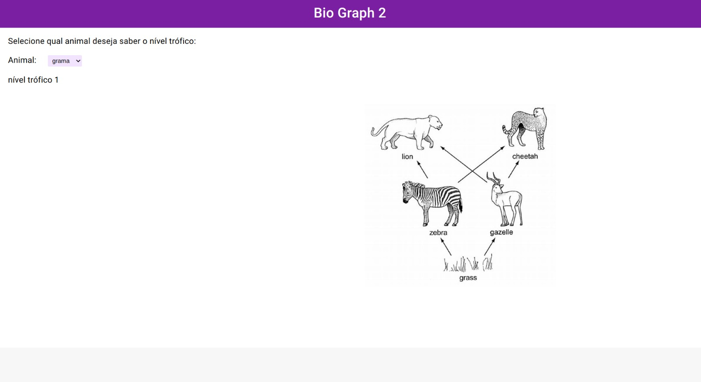

**BioGraph2** 

Temas:
 - Grafos2
 - Algoritimo do menor caminho de c

# BioGraph2

**Número da Lista**: 4 
**Conteúdo da Disciplina**: Algoritimo de Dijkstra 

## Alunos
|Matrícula | Aluno |
| -- | -- |
| 170107574  |  Laís Ramos Barbosa|
|21/1031833  |  Taynara Cristina Ribeiro Marcellos |

## Sobre 
O objetivo principal do projeto é representar uma cadeia alimentar utilizando a estrutura de dados Grafo para representar um fluxo energético, aplicando o Algoritimo de Dijkstra para achar o nível trófico de cada ser, iniciando por um nó específico(nó do produto) e termindo no nó do animal desejado.

## Screenshots

## Instalação 
**Linguagem**: Java, Javascript, Typescript 
**Framework**: (caso exista) 
Para rodar o projeto é necessário que se tenha instalado na máquina o Java SDK17, o Angular, o Maven e um editor de texto da sua escolha.

## Uso 
1. Para rodar o servidor, apenas clique em run que irá rodar a aplicação
2. Para rodar o front-end, abra na pasta front-end>biograph-ui> e rode o comando ng serve

